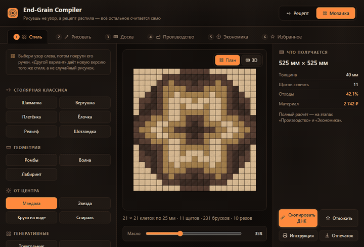
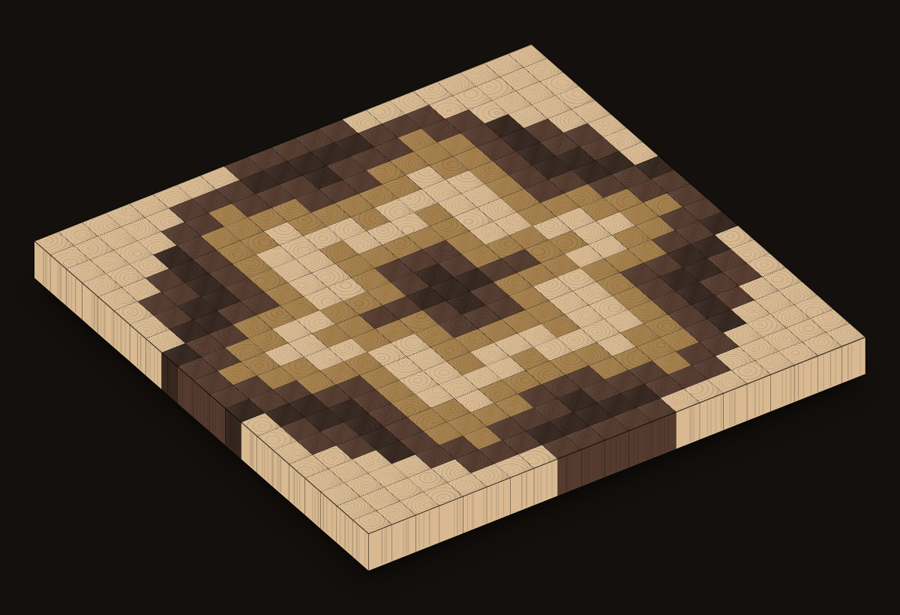
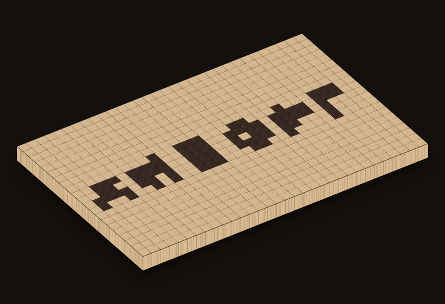
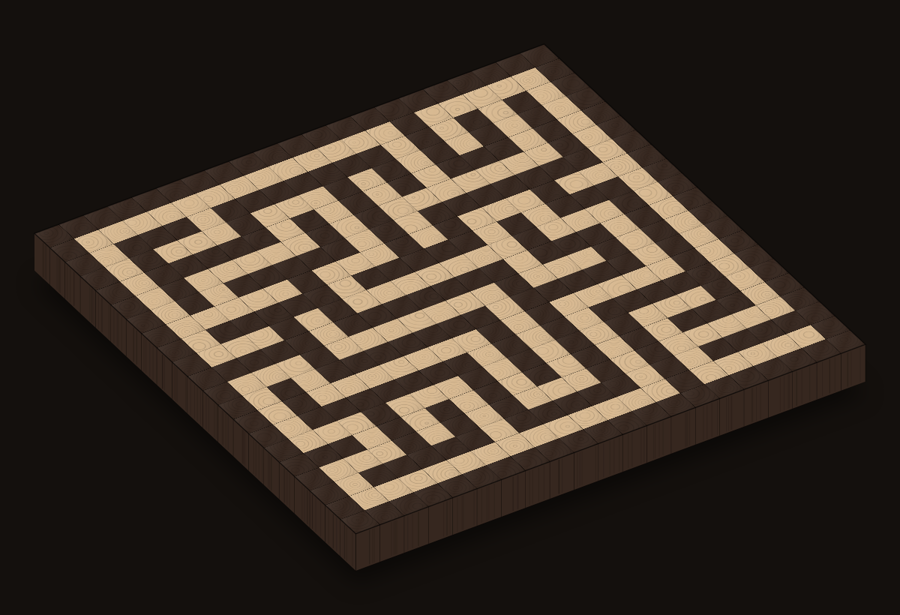
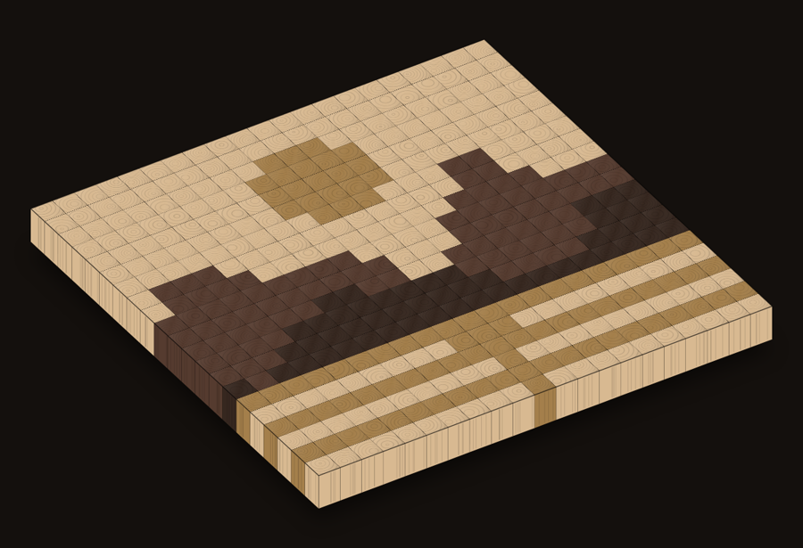
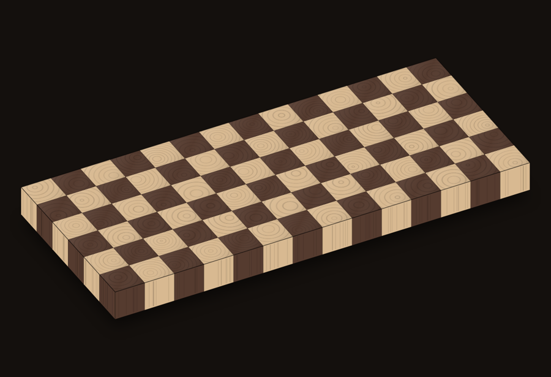

# End-Grain Compiler

**Живая версия: [sander419.github.io/endgrain/](https://sander419.github.io/endgrain/)** ·
Исходники: [github.com/sander419/endgrain](https://github.com/sander419/endgrain)

Работает без установки и без сервера: открыл ссылку — можно проектировать.
**Инструкция для пользователей: [GUIDE.md](GUIDE.md)** — как спроектировать доску и что
делать с расчётом в мастерской.

Быстрые ссылки для знакомства:
[мозаика-мандала](https://sander419.github.io/endgrain/?mode=mosaic&gen=mandala) ·
[пейзаж](https://sander419.github.io/endgrain/?mode=mosaic&gen=landscape) ·
[лабиринт](https://sander419.github.io/endgrain/?mode=mosaic&gen=maze) ·
[надпись](https://sander419.github.io/endgrain/?mode=mosaic&text=%D0%94%D0%9E%D0%9C) ·
[инструкция для мастерской](https://sander419.github.io/endgrain/?mode=recipe&print=1)

## Две версии

Проектирование, расчёт, карта раскроя и инструкция для цеха **бесплатны и остаются
бесплатными** — в том числе для мастерской, которая делает доски на продажу. Ключом
открывается версия «Мастерская»: то, что привязано к конкретному делу, а не к доске.

| Бесплатно | «Мастерская» |
|---|---|
| 16 стилей, кисть, текст, фото, ручная правка | профиль и бренд в документах |
| размеры, масса, отходы, себестоимость | заказы: клиент, срок, цена, статус, архив |
| движение древесины и столярный чек | партия: во что обходится десятая доска |
| карта раскроя и список покупки | склад: сколько **до**купить, а не купить |
| печатная инструкция для мастерской | коммерческое предложение клиенту |
| Board DNA в ссылке | паспорт изделия с уходом и номером рецепта |
| энциклопедия и вердикт готовности | журнал факта: свои нормативы вместо чужой оценки |
| — | витрина: каталог досок одним файлом с кнопкой «написать» |

Ключ проверяется **на вашем компьютере, без интернета** и без аккаунта: приложение
по-прежнему статическое, ничего никуда не отправляет. Провал проверки просто
возвращает бесплатную версию — работа в цеху не останавливается.

**Витрина — не магазин.** Она отдаёт каталог одним HTML-файлом: картинки внутри,
кнопка «написать» в WhatsApp или Telegram с уже подставленным номером рецепта.
Ни одного внешнего запроса, поэтому страница ничего не сообщает о посетителе.
Файл кладут куда хотят. Платежей нет и не будет — почему, сказано
в [docs/ROADMAP.md](docs/ROADMAP.md).

Условия — в [LICENSE](LICENSE). Границы модели, включая то, что здесь считается,
а что оценивается, — в [docs/ROADMAP.md](docs/ROADMAP.md).

## Демо

**Ролик на 37 секунд: [demo.mp4](https://sander419.github.io/endgrain/demo.mp4)** — без звука, с титрами.
Ниже та же история десятью секундами GIF, чтобы смотреть прямо здесь:



Рисунок → компиляция в щиты → карта раскроя → печатная инструкция. Доска в 3D крутится сама,
пока её не потянули мышью.

Оба собраны без записи экрана: кадры сняты headless-браузером по прямым ссылкам приложения
(`?shot=1` — доска без интерфейса), вращение взято из собственной анимации страницы, склейка — ffmpeg.

## Примеры

Снято прямо в приложении (`?shot=1` — доска без интерфейса), каждая картинка кликабельна
и открывает свой проект целиком: рецепт, порядок операций, себестоимость.

| | |
|---|---|
| [](https://sander419.github.io/endgrain/?mode=mosaic&gen=mandala&view=3d)<br>**Мандала** · 21×21 клетка, 4 породы · 11 щитов, 231 брусок | [](https://sander419.github.io/endgrain/?mode=mosaic&text=%D0%A5%D0%98%D0%91%D0%9E%D0%A0%D0%93&view=3d)<br>**Надпись** · сетка сама расширяется под длину слова |
| [](https://sander419.github.io/endgrain/?mode=mosaic&gen=maze&view=3d)<br>**Лабиринт** · настоящий проходимый, генерируется обходом | [](https://sander419.github.io/endgrain/?mode=mosaic&gen=landscape&view=3d)<br>**Пейзаж** · 4 породы, горизонт и отражение |
| [](https://sander419.github.io/endgrain/?mode=recipe&stage=pattern&view=3d)<br>**Шахматка** · режим «Рецепт», 560×240×40, отходы 21.1% | |

Каждая ссылка ниже — не картинка, а полный проект: Board DNA целиком в URL, без сервера и базы.

| | |
|---|---|
| [Ручная раскладка планок](https://sander419.github.io/endgrain/?mode=recipe#dna=eyJ2IjoxLCJzZWVkIjoxLCJyZWNpcGUiOnsidW5pdHMiOiJtbSIsInNwZWNpZXMiOnsibWFwbGUiOnsiaWQiOiJtYXBsZSIsIm5hbWUiOiLQmtC70ZHQvSIsImNvbG9ySGV4IjoiI0U4QzlBMCIsImRlbnNpdHlLZ00zIjo3MDUsInByaWNlUGVyQ3ViaWNNZXRlciI6OTUwMDB9LCJ3YWxudXQiOnsiaWQiOiJ3YWxudXQiLCJuYW1lIjoi0J7RgNC10YUiLCJjb2xvckhleCI6IiM1QjQwMzQiLCJkZW5zaXR5S2dNMyI6NjEwLCJwcmljZVBlckN1YmljTWV0ZXIiOjE5MDAwMH19LCJwYW5lbCI6eyJzdHJpcHMiOlt7InNwZWNpZXNJZCI6Im1hcGxlIiwid2lkdGhNbSI6NDB9LHsic3BlY2llc0lkIjoid2FsbnV0Iiwid2lkdGhNbSI6NDB9LHsic3BlY2llc0lkIjoibWFwbGUiLCJ3aWR0aE1tIjo0MH0seyJzcGVjaWVzSWQiOiJ3YWxudXQiLCJ3aWR0aE1tIjo0MH0seyJzcGVjaWVzSWQiOiJtYXBsZSIsIndpZHRoTW0iOjQwfSx7InNwZWNpZXNJZCI6IndhbG51dCIsIndpZHRoTW0iOjQwfV0sInN0cmlwVGhpY2tuZXNzTW0iOjQwLCJ1c2FibGVMZW5ndGhNbSI6NjAwfSwiY3Jvc3NjdXQiOnsic2xpY2VUaGlja25lc3NNbSI6NDAsInNhd0tlcmZNbSI6MywiYmxhZGVBbmdsZURlZyI6OTB9LCJ0cmFuc2Zvcm0iOnsiZmxpcE9kZFNsaWNlcyI6ZmFsc2UsImN5Y2xpY1NoaWZ0U3RlcCI6MCwibWFudWFsU2xpY2VzIjpbWzAsMSwyLDMsNCw1XSxbMSwyLDMsNCw1LDBdLFsyLDMsNCw1LDAsMV0sWzMsNCw1LDAsMSwyXSxbNCw1LDAsMSwyLDNdLFs1LDAsMSwyLDMsNF0sWzAsMSwyLDMsNCw1XSxbMCwxLDIsMyw0LDVdLFs1LDAsMSwyLDMsNF0sWzQsNSwwLDEsMiwzXSxbMyw0LDUsMCwxLDJdLFsyLDMsNCw1LDAsMV0sWzEsMiwzLDQsNSwwXSxbMCwxLDIsMyw0LDVdXX0sImFsbG93YW5jZXMiOnsidGhpY2tuZXNzU3VyZmFjaW5nTW0iOjMsInN0cmlwV2lkdGhKb2ludE1tIjoyLCJwYW5lbEVuZFRyaW1NbSI6MzB9fX0) — режим «Рецепт», клён/орех, ручная раскладка планок. 560×240×40, отходы 21.1% |
| [Мандала «Рельеф»](https://sander419.github.io/endgrain/?mode=mosaic&gen=mandala) — режим «Мозаика», 4 породы, 21×21 клетка. 11 щитов, 231 брусок |
| [Надпись «ХИБОРГ»](https://sander419.github.io/endgrain/?mode=mosaic&text=%D0%A5%D0%98%D0%91%D0%9E%D0%A0%D0%93) — текст в клетках, клён/венге. 8 щитов, 168 брусков |

**Рисуешь не узор, а рецепт распила — всё остальное считается само.**

Инструмент проектирования торцевых разделочных досок. Не рисовалка квадратов:
модель данных — это рецепт производственных операций, а узор, карта раскроя,
отходы, себестоимость и инструкция для мастерской — его проекции.

```
1D-бруски → щит A → поперечный распил (kerf) → поворот/сдвиг планок → вторая склейка → доска
```

Нарисовать физически неизготовимую доску нельзя: разрешены только операции,
которые существуют на верстаке.

## Два режима

**Рецепт** — классическая двухэтапная доска: один щит A, поперечный распил, перестановка планок.
Дёшево в работе, но набор брусков в каждой планке один и тот же, поэтому произвольную картинку
так не сделать.

**Мозаика** — конструктор рисунка по клеткам: мандалы, фракталы, пейзажи, надписи, ручная кисть.
Компилятор раскладывает картинку на щиты: находит уникальные колонки, назначает каждой щит и
считает, сколько планок из него нарезать. Зеркальные колонки берутся из одного щита —
планку просто кладут другим концом, и это заметно сокращает число склеек.

Цена мозаики честно показана в отчёте: щитов склеить, брусков заготовить, резов сделать.
Симметричный рисунок дешевле несимметричного примерно вдвое.

**Блочная сборка.** `analysis.ts` ищет в рисунке повторяющийся блок. Если он есть, вкладка
«Производство» предлагает собрать один блок и размножить его вместо одной длинной склейки:
короткие струбцины вместо длинных, блоки клеятся параллельно, и брак в одном блоке не убивает
всю доску. Компилятор щитов этого не видит — он считает колонки, а не мотивы.

## Запуск

```bash
npm install
npm run dev
```

Прод-сборка — `npm run build` (статика в `dist/`, бэкенда нет).
Тесты — `npm test` (Vitest, 397 тестов).

Выпуск лицензионных ключей (нужен приватный ключ, в репозиторий он не входит):

```bash
node tools/issue-license.mjs keygen
node tools/issue-license.mjs --workshop "Название" --months 12
node tools/issue-license.mjs --check <ключ>
```

## Что умеет

- **Редактор рецепта** — бруски (порода, ширина), толщина, длина щита, толщина среза, пропил.
- **Трансформации** — переворот нечётных планок на 180°, циклический сдвиг.
- **Ручная правка узора** — клик по планке на превью: перевернуть, сдвинуть, поменять местами
  с соседней, сбросить под общие правила. Планка **перетаскивается мышью** на новое место
  (перенос со сдвигом соседей, место вставки помечено линией). Клавиши: ← → выбор,
  `F` переворот, `[` `]` сдвиг, `R` сброс, `Esc` снять выбор. Правленые планки помечены уголком.
- **Отмена** — `Ctrl+Z` / `Ctrl+Shift+Z`, глубина 60 шагов; правки подряд склеиваются в одну.
- **Набор брусков** — перенос вверх/вниз, дублирование, «зеркалить набор» (A-B-C → A-B-C-C-B-A),
  разворот порядка.
- **6 пресетов** + «дикая доска» на seeded random (mulberry32: один seed — один узор).
- **Process Cinema** — 5 этапов сборки с живой отрисовкой: бруски → щит A → распил → трансформация → доска.
- **Производственный расчёт** — количество планок с учётом kerf, финальные размеры, сырой и чистый
  объём, board feet, потери на пропил и торцовку, масса, себестоимость по породам.
- **Столярный чек** — блокирующие ошибки и предупреждения (тонкий брусок, склейка, которую не
  стянуть, конфликт усушки, бесполезный переворот при симметричном наборе).
- **3D-превью** — доска в объёме на этапе «Доска»: тянешь мышью — поворачивается, пока не
  тронули — крутится сама. Прямая ссылка `?view=3d`. Работает и в «Мозаике». Без three.js:
  камера ортографическая, поэтому верхняя грань кладётся на экран готовой текстурой торцов
  аффинным преобразованием, а боковины — четыре плоскости с продольным волокном.
- **Карта раскроя** — сколько досок купить и как разложить бруски. Раскрой гильотинный
  (торцовка на полосы → роспуск вдоль), каждый рез съедает пропил. Нетронутый хвост доски
  считается остатком на следующий проект, а не отходом; отход считается от распиленной части.
  Схема по каждой доске — на экране и в печатной инструкции.
- **Масло** — слайдер проявки текстуры (темнеет тон, растёт насыщенность).
- **Board DNA** — весь проект в ссылке `#dna=…`, открывается у любого без установки.
- **Инструкция для мастерской** — печатный лист (Ctrl+P → PDF): спецификация брусков с припусками,
  пять шагов, схема переклейки (порядок брусков в каждой планке), материалы, чек-лист.
  Предпросмотр — `?print=1`.
- **Экспорт PNG** — «отпечаток доски».

## Что умеет режим «Мозаика»

Интерфейс разбит на вкладки — «Стиль», «Рисовать», «Доска», «Производство», «Избранное».
Инструменты показываются только те, что относятся к текущей задаче, и превью переключается
вместе с вкладкой: подсветка щитов включается на «Производстве», кисть работает на «Рисовать».

- **16 стилей в четырёх семействах**:
  - *Столярная классика* — шахматка, вертушка, плетёнка, ёлочка, рельеф, шотландка;
  - *Геометрия* — ромбы, волна, лабиринт (настоящий проходимый, генерируется обходом);
  - *От центра* — мандала, звезда, круги на воде, спираль;
  - *Генеративные* — треугольник и ковёр Серпинского, пейзаж.
- **Вариации внутри стиля, а не случайный шум.** Каждый стиль объявляет свои ручки
  (`GeneratorMeta.controls`), и UI показывает только их — мёртвых ползунков нет.
  `seed` сдвигает фазу, начало отсчёта и глубину мотива: рисунок меняется, стиль остаётся.
  У фракталов вариаций нет честно — они помечены `seeded: false`, и вместо кнопки
  «другой вариант» показывается объяснение.
- **Избранное** — отложить понравившийся вариант с миниатюрой и вернуться к нему позже,
  чтобы экспериментировать дальше без страха потерять удачное.
- **Свой текст** — надпись растеризуется системным шрифтом и ложится в клетки; кириллица и
  латиница без вшитых битмапов. Короткое слово на сетке от 20 клеток читается уверенно.
- **Своё фото** — импорт картинки: центральный кроп под пропорции доски, подбор ближайшей породы
  по цвету (без квантизации — палитра фиксирована и мала, нужен только nearest-neighbor).
  Работает лучше с силуэтом на контрастном фоне, чем с портретом — на редкой сетке мелкие детали
  теряются. Слайдер контраста пересчитывает уже загруженное фото без повторной загрузки.
- **Кисть** — рисование прямо по доске, клетка за клеткой, с зажатой кнопкой мыши.
- **Палитра** до 7 пород, сортируется от светлой к тёмной (генераторы это учитывают).
- **План производства** — список щитов с порядком брусков, число планок и длина каждого щита;
  наведение подсвечивает колонки этого щита на доске.
- **Инструкция** — спецификация, таблица щитов, карта сборки (какая планка из какого щита и
  какой стороной), движение древесины, экономика, чек-лист. Это полный паспорт изделия:
  всё, что видно на экране, попадает в бумагу, которую уносят в мастерскую.

Ограничение разрешения честное: клетка — это торец бруска 25–30 мм, поэтому доска 21 × 21
клетка это 525 мм. Фотографический пейзаж в таком масштабе не выйдет, силуэтный — выйдет.

## Инженерная часть

**Движение древесины.** Дерево меняет размеры вслед за влажностью воздуха, и в торцевой доске
это критичнее, чем в любой другой: волокна стоят вертикально, поэтому доска движется в плоскости
сразу в двух направлениях, а соседние бруски разных пород двигаются по-разному — разница ложится
напряжением на клеевой шов. Приложение считает равновесную влажность для заданного климата
(модель Hailwood–Horrobin, Wood Handbook гл. 4) и изменение размеров каждой породы
(коэффициент из гл. 13). Пять контрольных точек справочной таблицы EMC закреплены тестами:
при 21 °C и 65% влажности воздуха дерево приходит к 12% — если формулу тронуть, тест упадёт.

Пример из приложения: переход из зимней мастерской (18 °C, 35%) на кухню во время готовки
(24 °C, 75%) поднимает влажность дерева с 7.0% до 14.3%, и брусок клёна шириной 40 мм
разбухает на 0.96 мм, а ореха — на 0.76 мм.

**Данные пород сверены поштучно** 12.08.2026 по The Wood Database, с датой и ссылкой у каждой
записи. Сверка была не формальностью: до неё усушка дуба стояла 4.4/8.4 вместо 5.6/10.5,
а плотность врала у пяти пород из семи. Считать движение по таким числам было бы бессмысленно.

**Предупреждения объясняют, а не констатируют.** Каждое отвечает на четыре вопроса: что не так,
почему так происходит, чем грозит и что сделать. Где правило из справочника — указан источник.

**Профиль мастерской.** Инструкция «выровняй на барабанном станке» бесполезна тому, у кого его
нет, поэтому операции описаны через требование к инструменту, а не через конкретный станок,
и у каждой есть обходной путь с честной оценкой, во сколько раз он дольше. Отметил свой набор —
порядок работ переписался и на экране, и в печатной инструкции. Например, без барабанного
шлифстанка выравнивание идёт фрезером по салазкам, и приложение отдельно предупреждает, что
рейсмус на торцевую доску пускать нельзя: вырывает волокна. Если нечем закрыть шаг совсем
(нет струбцин, нет ни одной пилы) — так и сказано, вместо бодрого рецепта в никуда.

**Экономика.** Материал — меньшая часть себестоимости штучного изделия, основное съедает время.
Приложение оценивает время по этапам, считает полную себестоимость с трудом и накладными
и предлагает цену продажи диапазоном, а не одним числом: точная цифра здесь была бы враньём.
Нормативы времени — оценка для мастерской-одиночки, все ставки правятся в интерфейсе.

## Как изготовить доску по расчёту

1. Выстругать бруски в размер из таблицы «Заготовка брусков» — размеры уже с припусками
   на фугование, рейсмус и торцовку.
2. Склеить щит A в порядке, указанном в инструкции.
3. Торцевать край начисто и нарезать планки толщиной, равной толщине готовой доски.
   Пропил учтён: для N планок нужно N−1 резов, каждый съедает kerf.
4. Развернуть планки по схеме (переворот/сдвиг), поставить торцами вверх.
5. Склеить второй раз, стянуть, вывести плоскость, снять фаску, промаслить.

## Модель

Ядро (`src/core/`) не знает про React и рисование — чистые функции над `Recipe`:

| Модуль | Что делает |
|---|---|
| `types.ts` | Каноническая модель. Все расчёты в мм, `units` — только отображение |
| `projection.ts` | `sliceCount`, размеры, cut list, объёмы, отходы, себестоимость |
| `transforms.ts` | Матрица узора: flip, циклический сдвиг, ручные перестановки |
| `presets.ts` | 6 пресетов + `randomizeWild` |
| `random.ts` | mulberry32 — детерминированный генератор |
| `edit.ts` | Ручные операции: правка планки, обмен планок, перестановка брусков щита |
| `mosaic.ts` | Режим мозаики: модель рисунка и компилятор в набор щитов |
| `generators.ts` | 16 стилей, каждый со своими ручками и seed-вариациями |
| `analysis.ts` | Разбор рисунка: повторяющийся блок и симметрия → способ сборки |
| `favorites.ts` | Избранные рисунки с миниатюрами в localStorage |
| `color.ts` | Подбор ближайшей породы по цвету — для импорта фото |
| `moisture.ts` | Движение древесины: равновесная влажность и изменение размеров |
| `economics.ts` | Время работ, себестоимость, цена продажи |
| `workshop.ts` | Набор станков → порядок работ с обходными путями |
| `validate.ts` | «Столярный чек»: предупреждения, не блокирующие экспорт |
| `share.ts` | Board DNA: рецепт ↔ base64url в hash |
| `oil.ts` | Эффект масла на цвете |
| `process.ts` | Подсказки этапов сборки |
| `defaults.ts` | Справочник пород (плотность, цена, усушка), дефолтный рецепт |

Ключевая математика:

```
N = floor((U + k) / (S + k))          планок из щита длиной U, срез S, пропил k
usedLength = N*S + (N-1)*k            занятая длина щита
V_kerf = (N-1) * k * W * T            потери на пропил (резов N−1, не N)
topLength = N * stripThickness        длина готовой доски
topWidth  = Σ widthMm                 ширина готовой доски
thickness = sliceThickness            толщина готовой доски
```

Эталонный кейс (шахматка, клён+орех, 4 бруска по 40 мм, щит 400 мм, kerf 3 мм)
зафиксирован тестом: 9 планок, 360×160×40 мм, отходы 22.96%.

**Что нельзя нарисовать в режиме рецепта и почему.** Планка — цельный срез щита, поэтому набор
брусков в ней всегда один и тот же: допустимы перестановки, но не подмена. Покрасить одну ячейку
нельзя — порода меняется у бруска щита, то есть сразу во всех планках. Это не ограничение
интерфейса, а физика: клетка на доске и есть торец конкретного бруска. Нужен произвольный
рисунок — это режим «Мозаика», где под каждую уникальную колонку клеится свой щит.
Переворот планки на 180° бесплатен, а сдвиг брусков внутри планки — уже распил по клеевому
шву и переклейка; «Столярный чек» об этом предупреждает.

## Безопасность и приватность

Бэкенда нет: всё считается в браузере, рисунки никуда не отправляются, аккаунтов и
куки-трекеров тоже нет. Отсюда узкая поверхность атаки — и один настоящий вход:
**Board DNA приходит из чужой ссылки**, которую прислали в чате.

`core/sanitize.ts` разбирает этот вход, потому что проверено — без него ссылка могла:

- **повесить вкладку получателя**: `usableLengthMm: 1e9` при толщине среза `0.0001`
  давало миллиард планок и отрисовку в out-of-memory. Теперь числа зажимаются в
  производственные пределы (щит ≤ 3 м, срез ≥ 5 мм → не больше 600 планок);
- **сообщить отправителю, что ссылку открыли**: `colorHex: "url(https://…)"` доезжал до
  inline-стиля образца породы, и браузер шёл за картинкой на чужой сервер. Теперь цвет
  обязан быть `#rrggbb`, остальное заменяется.

XSS тут не было и раньше — React экранирует текст, `dangerouslySetInnerHTML` в проекте нет, —
но «нет XSS» и «безопасно открыть чужую ссылку» это разные утверждения. Прототипные ключи
(`__proto__`) в объект пород не пускаются, подписи обрезаются, `NaN` и мусор заменяются
рабочими значениями. Тот же санитайзер применяется к `localStorage`: туда мог попасть
чужой рецепт в прошлый визит.

Второй рубеж — **Content-Security-Policy**: `connect-src 'self'` и `img-src` без внешних
хостов не дают странице ничего отправить наружу и ни за чем сходить, даже если адрес всё же
просочится в данные. Политика ставится мета-тегом в прод-сборку (`vite.config.ts`), а не
заголовком сервера — так она едет вместе со статикой и не разъезжается с кодом.
`style-src` вынужденно с `'unsafe-inline'`: React ставит инлайновые стили атрибутом.

Хостинг — GitHub Pages, свои заголовки там не настраиваются: от него достаётся HSTS, всё
остальное живёт в самой странице. CSP работает мета-тегом (проверено: внешняя картинка
блокируется), политика реферера — тоже мета-тегом, и это здесь не формальность: в URL лежит
Board DNA, то есть весь проект пользователя, и без политики он уезжал бы в `Referer` целиком.

Чего на Pages принципиально нет: `X-Content-Type-Options` и `X-Frame-Options` — они бывают
только заголовками. Первое почти безвредно, раз типы отдаются корректно; второе значит, что
страницу можно вставить в чужой фрейм. Кликджекинг тут ничего не даёт: ни логина, ни действий
с последствиями — нажимать от чужого имени нечего.

Прод-зависимостей две — `react` и `react-dom`, `npm audit` чист. Сборку публикует workflow
с минимальными правами (`contents: read`, `pages: write`), запускается только с `main`,
так что пул-реквест из форка выкатить ничего не может.

## Ограничения V1

- Только прямой рез 90° (косые — отдельная задача).
- Толщина всех брусков в щите одинаковая.
- Клеевые швы не считаются отдельным объёмом.
- Раскрой гильотинный и жадный (first-fit по убыванию): раскладка не гарантированно
  оптимальная, зато выполнимая на циркулярке. Обрезки между полосами повторно не
  используются — только целый хвост доски.
- 3D-превью без освещения и теней на самой доске: ортографическая камера, плоская заливка
  боковин. Это превью формы, а не рендер.

## Стек

React 19 + TypeScript + Vite, Canvas 2D, Vitest. Ни бэкенда, ни аккаунтов, ни зависимостей
в рантайме, кроме React. Прод-бандл — 103 КБ gzip.

## Деплой

Статика (`npm run build` → `dist/`) выкатывается на GitHub Pages сама: workflow
`.github/workflows/pages.yml` на каждый push в `main` ставит зависимости, прогоняет тесты
и публикует сборку. Тесты в цепочке не для красоты — на живую ссылку попадает только то,
что их прошло.

`vite.config.ts` собирает с `base: './'` — без этого абсолютные пути на `/assets/`
резолвились бы от корня домена, а не от `/endgrain/`, и все скрипты со стилями давали бы 404.
